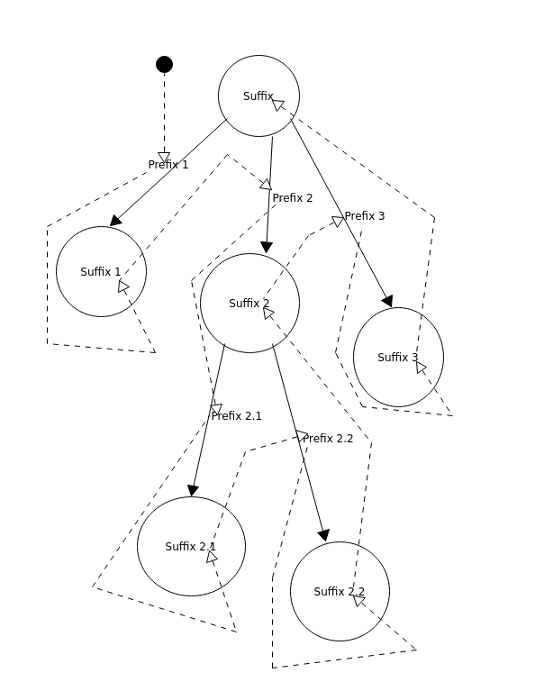

# A mapping between Jevko and visual trees

The [minimal formulation of the Jevko grammar](https://jevko.org) is very flexible.

In certain contexts though it may be more advantageous to use an alternative grammar which is more rigid.

In particular the following grammar:

```abnf
Value = Subvalues Suffix
Subvalue = Prefix "[" Value "]"

Subvalues = *Subvalue
Suffix = *Char
Prefix = *Char

Char = Escape / %x0-5a / %x5c / %x5e-5f / %x61-10ffff
Escape = "`" ("`" / "[" / "]")
```

matches the same strings as the minimal grammar, except that it is unambiguous in terms of ABNF semantics and it enforces certain structure in parse trees that it generates.

For example the following string:

```
Prefix 1 [Suffix 1] 
Prefix 2 [
  Prefix 2.1 [Suffix 2.1] 
  Prefix 2.2 [Suffix 2.2] 
  Suffix 2
]
Prefix 3 [Suffix 3]
Suffix
```

Can be visualised with the following parse tree:



Note:

* Most whitespace is ignored in the visualisation
* Solid arrows point from parent nodes to child nodes
* Dashed arrows show the direction in which the tree should be read to be consistent with the string
* Reading starts at the black dot and continues along the dashed lines
* The tips of the dashed arrows point to labels (affixes) which should be read in order

In other words the string serializes the tree in such a way that:

* The traversal is depth-first
* Solid arrow labels are serialized before node labels
* First: each child node is visited to serialize the label of the arrow that connects it with the parent (preorder traversal)
* Second: only after all child node arrow labels have been serialized is the parent node label serialized (postorder traversal)

