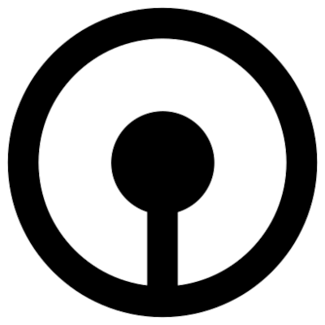

# New year, new logo for Jevko?

Looks like I couldn't help myself and designed yet another minimalist logo:

<!--  -->

It's a refresh of the logo for [Jevko](https://jevko.org) from last year:

<!--  -->

## Details

The new one is a bit less minimalist and perfectionist, in tune with my theme for the year.

The tree symbol in the logo is made of an elongated rectangle (the trunk) and three equilateral triangles stacked on top of each other, equidistantly (the crown). Each next triangle is 2/3 of the size of the previous one.

Once again, I aimed for 50/50 black and white balance, excepting the outline which is there mainly to prevent the logo from merging into black backgrounds.

***

© 2022 Darius J Chuck