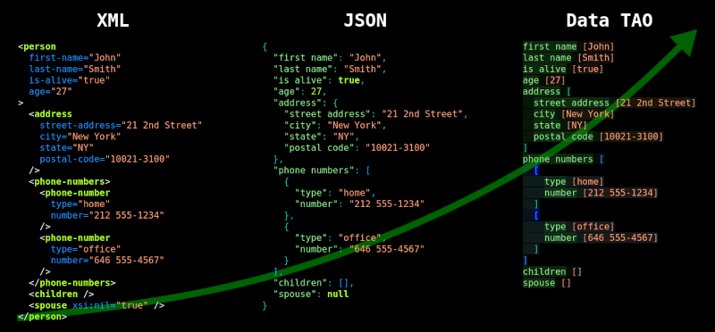
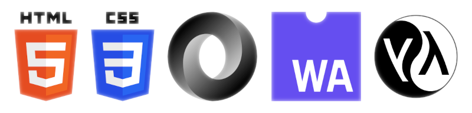

# A vision of total intercommunication of all software systems

This article was originally published on the front page of tree-annotation.org (now retired in favor of [jevko.org](https://jevko.org)).

## Introduction

<!-- The vision behind TAO is simple. -->

Syntax is so ubiquitous in software that it is taken for granted and often overlooked. Optimizing it is, for many reasons, not a very popular topic.

To give a feeling of the ubiquity: 

* the amount of translations of data to and from JSON or other formats to send it and process further is among the very very very large numbers, 

* every single website is, at some point, represented as HTML,

* all programs that run the Internet are written in some source code syntax,

* data and code represented with syntax is constantly read and written by people who work with them every day.

Considering this, even a small inefficiency or unnecessary complexity of a syntax along with accompanying processing and cognitive burdens will translate to massive loss of productivity.

[Jevko](https://jevko.org) is based on the thesis that a simpler and easier syntax shall bring incalculable returns across the software world. The greater the adoption, the greater and more compounded the benefits.

It is a logical step towards simplicity in software evolution.

## Historical precedents

The modern Web began with [HTML](https://developer.mozilla.org/en-US/docs/Web/HTML) which was designed as a markup language for static websites. As the Web became more dynamic, HTML's generalized counterpart, [XML](https://developer.mozilla.org/en-US/docs/Web/XML/XML_introduction), was pragmatically adopted as the universal notation for representing trees of data that were now sent between nodes.

These markup languages were however not well-suited for generic data representation. Another pragmatic step was taken to alleviate that. From [JavaScript](https://developer.mozilla.org/en-US/docs/Web/JavaScript), the dynamic language of the Web, [JSON](https://developer.mozilla.org/en-US/docs/Glossary/JSON) was extracted as a simpler and more suitable data notation.

Today HTML, JSON, and JavaScript are becoming low-level languages, often machine-generated rather than written directly.

JavaScript was not meant as a low-level language however, so it is not perfect as the assembly language of the Web.

[WebAssembly](https://developer.mozilla.org/en-US/docs/WebAssembly) is an emerging attempt to fix that. It adopts a generic human-readable syntax: [S-expressions](https://developer.mozilla.org/en-US/docs/WebAssembly/Understanding_the_text_format#s-expressions).

Interestingly, before [CSS](https://developer.mozilla.org/en-US/docs/Web/CSS) became established as the stylesheet language of the Web, there was an S-expression-based alternative to it called [DSSSL](https://en.wikipedia.org/wiki/Document_Style_Semantics_and_Specification_Language).

S-expressions were invented before the Web and serve as the basic syntax for code and data in the oldest syntactically-preserved family of languages, widely used to this day: [the LISP family](https://en.wikipedia.org/wiki/Lisp_(programming_language)). Many popular languages, including JavaScript, have roots in this family.

S-expressions are a minimal generic syntax, like Jevko. Because of that they can be used to encode different kinds of trees: data, markup, source code.

They were however not explicitly designed as a universal syntax and have some characteristics that prevented them from becoming one.

<!-- Minute syntax design decisions built into S-expressions that go back to the earliest days of computer language design prevented them however from becoming widely adopted as a universal syntax. -->

Jevko on the other hand is designed from the ground-up to be suited for precisely this purpose.

## Future

The vision of total intercommunication of all software systems can be realized through Jevko as follows.

First, simple and human-friendly notations are built on top of Jevko along with tools to enable their use.

These can be initially adopted for configuration, as standard input and output formats of offline tools, similarly to how JSON is used today.

<!-- These notations are very generic and sufficient for most common applications.

Any syntax can in principle be translated to TAO, but its goal is not to be a complete replacement for specialized syntaxes. -->

Jevko-based counterparts of JSON, HTML, CSS, S-expressions, and other notations can be gradually adopted and become standard.

The goal of this evolution is the achievement of low-level unification of the basic data, markup, style, configuration, and source code notations of the Web.

Such removal of fundamental incompatibilities obviates the need for incalculable number of unnecessary translations, freeing enormous computational and cognitive resources.

From that emerges a new and more efficient Web with Jevko as its syntactical backbone, accelerating further development and opening up exciting possibilities.

This vision can only be achieved in small steps over a long time with collaboration of everyone who is willing to make it a reality.

## Distant future

The hope is that Jevko could facilitate future interplanetary, interstellar, cosmic-scale communication.