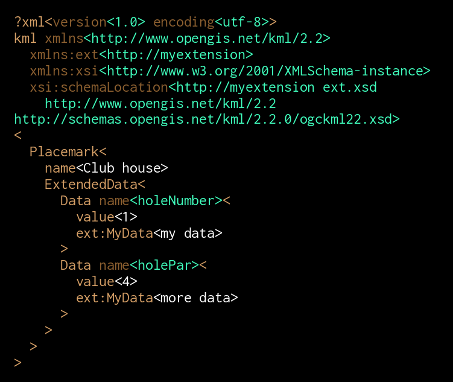

# Jevko as ultra-compact XML

In this short article I demonstrate how significant reductions in document size can be achieved by encoding XML in a Jevko-based format. I hope this can illustrate the potential to make data interchange for XML-based systems more efficient without losing human-readability or functionality.

Let's consider this XML sample:

```xml
<?xml version="1.0" encoding="utf-8"?>
<kml xmlns="http://www.opengis.net/kml/2.2"
  xmlns:ext="http://myextension"
  xmlns:xsi="http://www.w3.org/2001/XMLSchema-instance"
  xsi:schemaLocation="http://myextension ext.xsd
    http://www.opengis.net/kml/2.2 http://schemas.opengis.net/kml/2.2.0/ogckml22.xsd">
  <Placemark>
    <name>Club house</name>
    <ExtendedData>
      <Data name="holeNumber">
        <value>1</value>
        <ext:MyData>my data</ext:MyData>
      </Data>
      <Data name="holePar">
        <value>4</value>
        <ext:MyData>more data</ext:MyData>
      </Data>
    </ExtendedData>
  </Placemark>
</kml>
```

It's a typical example of applying XML to encoding structured data rather than marking up text. Usually in such applications only a subset of XML is used which notably excludes mixed content, used so ubiquitously in text markup.

Such subset can be compactly encoded with Jevko without loss of relevant information. For example like this:

```
?xml[version[1.0] encoding[utf-8]]
kml xmlns[http://www.opengis.net/kml/2.2]
  xmlns:ext[http://myextension]
  xmlns:xsi[http://www.w3.org/2001/XMLSchema-instance]
  xsi:schemaLocation[http://myextension ext.xsd
    http://www.opengis.net/kml/2.2 http://schemas.opengis.net/kml/2.2.0/ogckml22.xsd][
  Placemark[
    name[Club house]
    ExtendedData[
      Data name[holeNumber][
        value[1]
        ext:MyData[my data]
      ]
      Data name[holePar][
        value[4]
        ext:MyData[more data]
      ]
    ]
  ]
]
```

The original XML sample contained 631 characters.

The reduced Jevko-encoded version only 525.

That's an almost 17% reduction in size which can grow significantly for a larger sample, especially with a great number of tags (as opposed to attributes). In fact if we only take into account the part the Placemark tag and its contents, the reduction grows to over 29% (92/314). At the same time we get a much simpler format without losing human-readability. Even insignificant whitespace is preserved exactly.

Without losing relevant information a similar reduction is hardly possible even when the XML is converted to JSON. I was not able to get anywhere close using various online converters[[1]](https://jsonformatter.org/xml-to-json)[[2]](https://www.convertjson.com/xml-to-json.htm)[[3]](https://www.utilities-online.info/xmltojson). In fact the transformations that have to be done to represent XML in JSON often cancel out the gain or even make the resulting JSON bigger than the input XML.

Even if it was possible to get a similar or greater reduction using JSON, JSON itself can be converted to Jevko with similar or greater reduction in size (see for example [here](https://jevko.org/#data) for a trivial JSON-Jevko comparison which achieves a 26 % reduction in size).

Additionally the flexibility of Jevko allows stylizing it to be more familiar-looking by using angle brackets instead of square brackets:



Although whether that's a good idea or not is a different question.

## Attribution

The XML sample is from [here](https://stackoverflow.com/a/23839124/7379821).

***

© 2022 Darius J Chuck