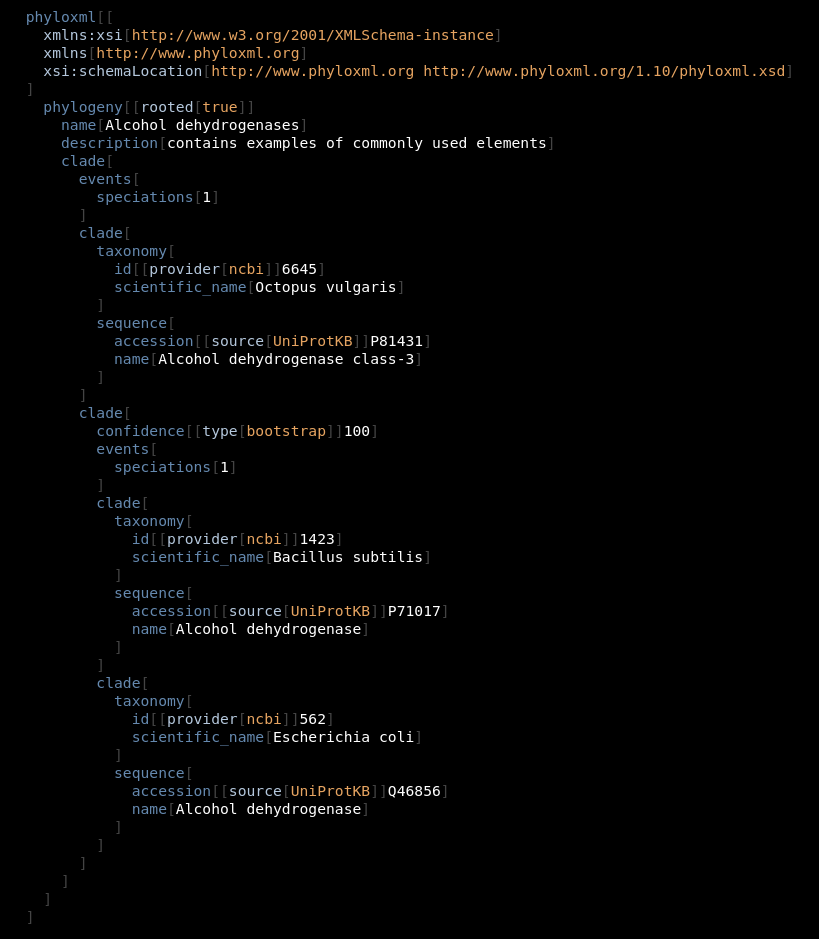

# Jevko as ultra-compact XML, take 2

Let's consider the following [phyloXML sample](http://www.phyloxml.org/examples_syntax/phyloxml_syntax_example_1.html):

```xml
<phyloxml
  xmlns:xsi="http://www.w3.org/2001/XMLSchema-instance"
  xmlns="http://www.phyloxml.org" 
  xsi:schemaLocation="http://www.phyloxml.org http://www.phyloxml.org/1.10/phyloxml.xsd"
>
  <phylogeny rooted="true">
    <name>Alcohol dehydrogenases</name>
    <description>contains examples of commonly used elements</description>
    <clade>
      <events>
        <speciations>1</speciations>
      </events>
      <clade>
        <taxonomy>
          <id provider="ncbi">6645</id>
          <scientific_name>Octopus vulgaris</scientific_name>
        </taxonomy>
        <sequence>
          <accession source="UniProtKB">P81431</accession>
          <name>Alcohol dehydrogenase class-3</name>
        </sequence>
      </clade>
      <clade>
        <confidence type="bootstrap">100</confidence>
        <events>
          <speciations>1</speciations>
        </events>
        <clade>
          <taxonomy>
            <id provider="ncbi">1423</id>
            <scientific_name>Bacillus subtilis</scientific_name>
          </taxonomy>
          <sequence>
            <accession source="UniProtKB">P71017</accession>
            <name>Alcohol dehydrogenase</name>
          </sequence>
        </clade>
        <clade>
          <taxonomy>
            <id provider="ncbi">562</id>
            <scientific_name>Escherichia coli</scientific_name>
          </taxonomy>
          <sequence>
            <accession source="UniProtKB">Q46856</accession>
            <name>Alcohol dehydrogenase</name>
          </sequence>
        </clade>
      </clade>
    </clade>
  </phylogeny>
</phyloxml>
```

It can be mapped to the following Jevko:



which contains identical information, is not less human-readable, and at the same time is much more efficient to process, because it is simpler and smaller (less than 79% of the size of the original XML).

<!-- 1261/1598
0.7891113892365457 -->


## See also

[Jevko as ultra-compact XML](2022-01-13-xml.md)