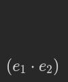
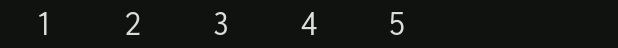
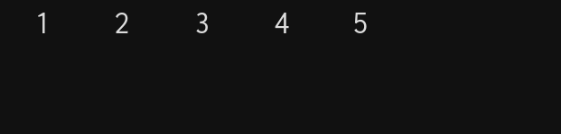
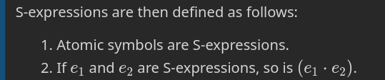
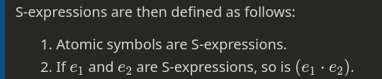
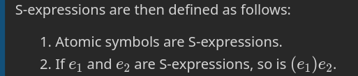
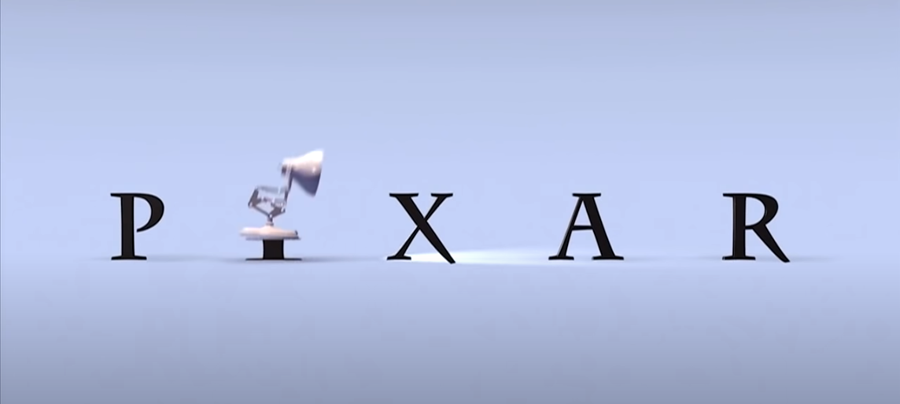
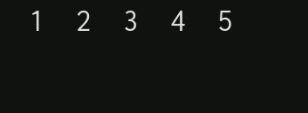
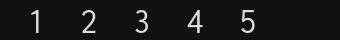
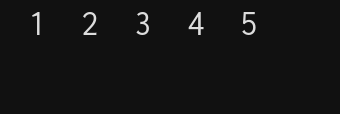

# Celebrating 1000000 years of Lisp: simplifying S-expressions

> [P]erfection is achieved not when there is nothing more to add, but when there is nothing more to take away. At the end of its evolution, the machine hides itself.

*from Wind, Sand and Stars by Antoine de Saint-Exupéry*

Sixty four (or $1000000_2$ in [binary](https://en.wikipedia.org/wiki/Binary_number)) years ago, in the ancient days of computing, a powerful yet remarkably simple programming language was born.

It gave rise to an entire family of languages which lives on to this day. A defining feature of this family, unchanged since the early 1960s, is its syntax -- the notation used to write programs.

The language is called [Lisp](https://en.wikipedia.org/wiki/Lisp_(programming_language)) (short for **Lis**t **p**rocessor) and the notation is called S-expressions (S stands for **S**ymbolic).

Even though the syntax is based around only a handful simple rules, it is flexible enough that it allows humans to succinctly write arbitrarily complex programs that can be quickly executed by machines.

Given their exceeding simplicity, S-expressions strike a remarkable balance between flexibility, beauty, power, and friendliness both to humans and machines which remains unsurpassed by any other notation.

Since the syntax has been stable for over 60 years, does that mean that it is perfectly optimal and there is no way to simplify it further without sacrificing the balance?

This article will show that the answer is no: it is possible to move a tiny step further towards perfection, to take away the inessential while preserving original excellence.

And we should do that not only because it is possible, but also because it is fun and beautiful, and because it's a celebration of perfection through simplicity -- a proper way to honor Lisp and what it stands for on its $1000000_2$ anniversary.

*this is how it's done*

## Introduction

The reference material for this article is taken from the paper [Recursive Functions of Symbolic Expressions and Their Computation by Machine, Part I](http://www-formal.stanford.edu/jmc/recursive/node3.html) by John McCarthy of Massachusetts Institute of Technology, published April 1960.

We will focus exclusively on the first part of section 3a. of the paper: *A Class of Symbolic Expressions* under **Recursive Functions of Symbolic Expressions**.

[First](#classical-s-expressions) we will analyze and explain what it says, [then](#simplified-s-expressions) we will simplify it, and finally we will [summarize and conclude](#summary-and-conclusion).

For completeness, [Appendix A](#appendix-a-the-original-definition-of-s-expressions-rewritten) contains the original definition of S-expressions from the paper slightly rewritten to incorporate our simplifications.

## Classical S-expressions

We will quote the contents of the paper directly in order, adding comments in between.

The paper starts by defining prerequisites for the definition of S-expressions, namely:

> [S-expressions] are formed by using the special characters 

> $.$

> $($

> $)$

> and an infinite set of distinguishable atomic symbols. For atomic symbols, we shall use strings of capital Latin letters and digits with single imbedded blanks. Examples of atomic symbols are

> $A$

> $A B A$ 

> $APPLE\ PIE\ NUMBER\ 3$

Our basic building blocks are thus:

* 3 special characters: dot and a pair of brackets
* and "atomic symbols", formed from letters of the alphabet and digits. These symbols are nothing but labels which can be assigned arbitrary meaning. In Lisp there is a number of labels with predefined meaning. Otherwise we pick the labels and define meaning for them as we please, according to the specific needs of the programs we write.

In that context, more meaningful examples of symbols include:

$MULTIPLY$

$ASSIGN$

$DISPLAY$

(these could be provided for us)

$WEEKLY\ PAY$

$HOURS\ WORKED$

$PAY\ RATE$

$COMPUTE\ WEEKLY\ PAY$

(these might be defined by us)

The 3 special characters are then used together with symbols to construct arbitrary programs. Or, more generally, to write down arbitrarily structured data.

In Lisp programs are seen as merely a special kind of data and all data is written using S-expressions.

Which brings us to the main point: **the definition of S-expressions themselves**. Here it is directly from the paper:

> S-expressions are then defined as follows:

> 1. Atomic symbols are S-expressions.
> 2. If *$ e_{1} $* and $ e_{2} $ are S-expressions, so is $ (e_1 \cdot e_2) $. 

Then we are given 3 basic examples:

> Examples of S-expressions are

> $AB$

> $(A \cdot B)$

> $((AB \cdot C) \cdot D)$

And an alternative formulation for the 2nd point of the definition:

> An S-expression is then simply an ordered pair, the terms of which may be atomic symbols or simpler S-expressions.

This is to underline the correspondence between S-expressions and the basic mathematical concept of the [ordered pair](https://en.wikipedia.org/wiki/Ordered_pair).

Next the paper provides a very important insight:

> We can can represent a list of arbitrary length in terms of S-expressions 

Meaning a list of 1, 2, 3, 10, 20, 100, 10000, or $n$ elements can be written as an S-expression or an ordered pair!

How? The paper gives a template:

> The list

> $(m_1, m_2, \cdots, m_n)$

> is represented by the S-expression

> $(m_1 \cdot(m_2 \cdot( \cdots(m_n \cdot NIL) \cdots )))$

> Here $NIL$ is an atomic symbol used to terminate lists

For example, a list of numbers such as $1, 2, 3, 4, 5$ can be turned into the S-expression $(1 \cdot (2 \cdot (3 \cdot (4 \cdot (5 \cdot NIL)))))$. 

Here are the pairs visualized one by one:

Or seen backwards, starting from the innermost pair:

Imagined once more, as if we were building up the list step-by-step:

In this way we can represent lists of arbitrary length as pairs.

### The problem of nested brackets

The problem with this notation is that the number of nested brackets grows proportionally with the length of the list and quickly becomes difficult to keep track of (for a human).

To solve this, the paper goes on to introduce a special abbreviated syntax for lists of arbitrary length, introducing a fourth special character (comma) for separating list items. The abbreviated syntax is incorporated into the definition of S-expressions, concluding section 3a of the paper.

Instead of getting into this abbreviated notation, in this article we shall propose an alternative, simpler solution to the problem of nested brackets which involves removing rather than adding a special character!

## Simplified S-expressions

It turns out that by introducing a tiny change in the definition, we can get rid of one of the special characters and fix the problem of nested brackets.

Here is how.

### Solution to the problem of nested brackets

Recall the original definition of S-expressions:

If we move the closing bracket in place of the dot:

we arrive at the following simplified definition:

This is really important, so let's hammer that in. What we did is this:

Our closing bracket is to the dot here what the lamp is to the letter I in this famous intro (click to see it on youtube):

Now let's recall the initial examples of S-expressions:

> $AB$

> $(A \cdot B)$

> $((AB \cdot C) \cdot D)$

and see how they look after introducing our simplification:

$ AB $

$ (A)B $

$ ((AB)C)D $

So where the dots were originally now we have closing brackets and where the closing brackets were we have nothing. Each pair is thus shorter by one character. So far so good.

Now let's compare our list of five numbers, originally written as

$(1 \cdot (2 \cdot (3 \cdot (4 \cdot (5 \cdot NIL)))))$ 

In our simplified form it is written like so:

$(1)(2)(3)(4)(5)NIL$

Once again, let's visualize the construction of the list from the elements, forward and backward:

As we can see, because of our change, the problem of the nested brackets has disappeared!

## Summary and conclusion

By displacing a dot with a bracket, we reduced the number of special characters by 1/3 and solved the problem of nested brackets, increasing conciseness and simplicity.

In our notation not only nesting of brackets `(())` but also their juxtaposition `()()` is meaningful. Since that is easier to process for humans, we have also improved human-friendliness.

Nothing of essence was lost, while things were substantially improved. We have achieved our goal of moving closer to perfection.

Perhaps another time we will get the chance to explore further and see how we can get from here to [Jevko](http://jevko.org).

Meanwhile, happy $1000000_2$ anniversary of Lisp!

## Appendix A: the original definition of S-expressions rewritten

We shall now define the S-expressions (S stands for symbolic). They are formed by using the special characters

$($

$)$

and an infinite set of distinguishable atomic symbols. For atomic symbols, we shall use strings of capital Latin letters and digits with single imbedded blanks. Examples of atomic symbols are

$ A $

$ A B A $ 

$ APPLE\ PIE\ NUMBER\ 3 $

S-expressions are then defined as follows:

1. Atomic symbols are S-expressions.
2. If  $ e_1 $  and  $ e_2 $  are S-expressions, so is  $ (e_1)e_2 $ .

Examples of S-expressions are

$ AB $

$ (A)B $

$ ((AB)C)D $

An S-expression is then simply an ordered pair, the terms of which may be atomic symbols or simpler S-expressions. We can can represent a list of arbitrary length in terms of S-expressions as follows. The list

$(m_1, m_2, \cdots, m_n)$

is represented by the S-expression

$(m_1)(m_2)\cdots(m_n)NIL$

Here $NIL$ is an atomic symbol used to terminate lists. 