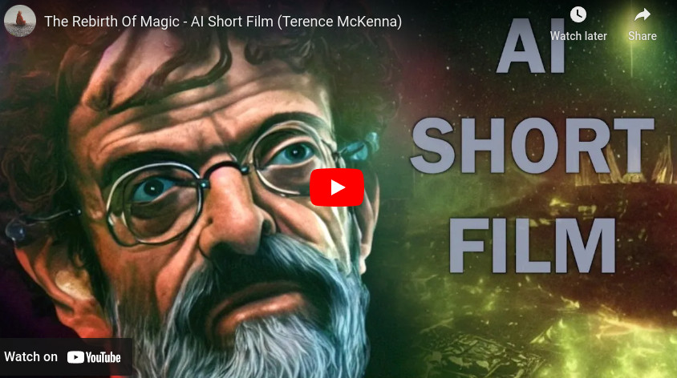
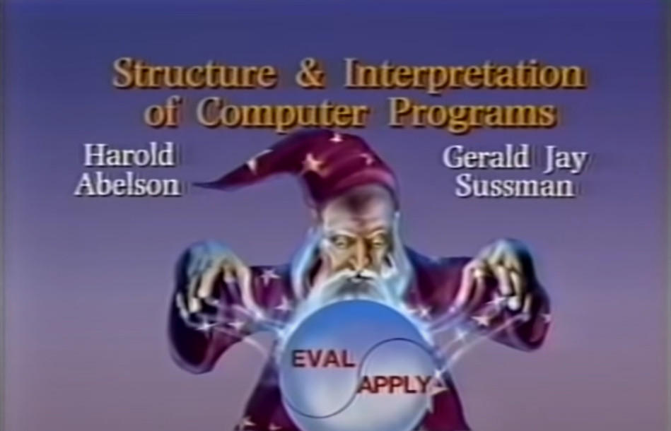

# Programming as magic

What is programming? Speaking to machines in arcane languages.

If you use the right spells, if you spell them out right, things happen. A process comes to life. The spirit that lives in the computer starts doing your bidding.

Controling spirits with spells: the definition of magic.

Programmers are wizards. And some of them know it.

> There's a good part of Computer Science that's like magic. Unfortunately there's a bad part of Computer Science that's like religion.

― Hal Abelson 

> Yet the program construct, unlike the poet's words, is real in the sense that in moves and works, producing visible outputs seperate from the construct itself. It prints results, draws pictures, produces sounds, moves arms. The magic of myth and legend has come true in our time. One types the correct incantation on the keyboard, and a display screen comes to life, showing things that never were nor could be.

― [Frederic P. Brooks](https://pages.cs.wisc.edu/~param/quotes/man-month.html)

Now you do too.

Go cast some spells.