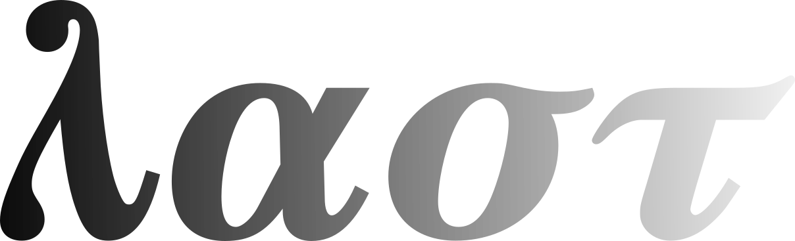

<style>
@media screen {
  html {
    /* todo: use for publishing a dark-mode draft: */
    filter: invert(1);
    font-size: 18pt;
  }
}
</style>



**Lambda calculus can be reduced down to 4 primitive operations.**

First, let's define a simplified grammar for a lambda calculus term that captures these operations syntactically:

```
term ::= abstraction
       | application
       | revelation
       | reference
```

A term is defined as either of the four basic operations.

We don't want to worry about parentheses, associativity, and precedence, so each operation shall use a distinct prefix operator with fixed arity. Effectively we'll be writing our terms in Polish notation -- the order of operations explicitly defined by the position of the operators, which are always evaluated left-to-right.

The first two operations should be more or less familiar. 

Abstraction is defined like so:

`abstraction ::=` $\boldsymbol{\lambda}$ `term`

The definition doesn't mention variable names. We only have a lambda $\lambda$, which we'll call the **abstraction operator**, prefixed to a term. This is the same as in N.G. de Bruijn's namefree syntax.

Now application is defined as:

`application ::=` $\boldsymbol{\alpha}$ `term term`

Instead of using juxtaposition, we introduce a two-argument **application operator**, alpha $\alpha$. Predictably, it applies the second term to the first.

With that out of the way, let's get to the interesting operations: revelation and reference.

As can be guessed, these replace variable references.

We will leave revelation for the end. First let's look at reference:

`reference ::=` $\boldsymbol{\tau}$

It's denoted simply by the letter tau $\tau$, which is our zero-argument **reference operator**. What it does is it refers to the topmost variable in current scope. 

Normally the topmost variable is the one introduced by the lambda closest to the current position. That is:

$$
\lambda \tau
$$

means the same thing as $\lambda x.x$. in the conventional notation. Similarly:

$$
\lambda \lambda \tau
$$

means the same thing as $\lambda x.\lambda y.y$ in the conventional notation.

That's all well and good, but how do we refer to a variable that is not topmost in current scope?

**Here is where the revelation comes in**:

`revelation ::=` $\boldsymbol{\sigma}$ `term`

Besides being a cool pun, the name is quite descriptive. The **revelation operator**, denoted by sigma $\sigma$, **creates a new scope for the term that follows it, with the topmost variable discarded**, thus *revealing* the next variable to the term. The topmost variable in the new scope is the one introduced by the lambda *one step back* from the current position. So:

$$
\lambda \lambda \sigma \tau
$$

means the same thing as $\lambda x.\lambda y.x$ in the conventional notation.

With these 4 operations, not only can we encode any and all lambda terms that we can encode in the conventional notation without using numerical de Bruijn indices or needing an infinite supply of names for variables.

Being more "low-level", this notation can actually represent most lambda terms in more than one way.

For example, a conventionally-encoded lambda term like:

$$
\lambda x.\lambda y.\lambda z.x
$$

Can be represented as:

$$
\lambda \lambda \lambda \sigma \sigma \tau
$$

or equivalently as:

$$
\lambda \lambda \sigma \lambda \sigma \tau
$$

Having $\sigma$ be an independent first-class operation, we can now choose the points at which we reveal the interesting (or equivalently: discard the uninteresting) variables.

This starts to matter when we add applications to the mix.

Consider a term like:

$$
\lambda x.\lambda y.\lambda z.x\,x\,x\,x
$$

Naively we could represent it as:

$$
\lambda \lambda \lambda \alpha \alpha \alpha \sigma \sigma \tau \sigma \sigma \tau \sigma \sigma \tau \sigma \sigma \tau
$$

But actually, we don't have to repeat the revelation operation twice for every application. We can "factor it out", like so:

$$
\lambda \lambda \lambda \sigma \sigma \alpha \alpha \alpha \tau \tau \tau \tau
$$

Now the scopes which the $\tau$ operations "see" already have the unnecessary variables discarded.

This equivalent encoding of the lambda term is not only shorter but more efficient in terms of the number of operations performed.

**With that, we are ready to introduce the notions of $\sigma$-equivalence and $\sigma$-reduction or $\sigma$-optimization, along with its inverse, $\sigma$-deoptimization**.

Those interested in how that may look like, I direct to the [Introduction to the LAST programming language](https://xtao.org/blog/last-intro.html), which describes the first incarnation of this idea I implemented last year. The LAST language works exactly in the way described here, except it uses the letters L, A, S, and T instead of $\lambda$, $\alpha$, $\sigma$, and $\tau$. The implementation also features $\sigma$-optimization, there called S-optimization, which is an algorithm I developed that transforms lambda terms into fully optimized $\sigma$-equivalents.

**I haven't mathematically proven that these are indeed fully optimized. I'd appreciate if anybody could help with that.**

I think it's pretty cool that it's possible to simplify lambda calculus like this and dig into its low-level details. It helps with gaining a deeper understanding of foundations of mathematics. This in turn is potentially useful in areas that draw from that, such as computer science, theory of programming languages, category theory, as well as philosophy or linguistics.

Recently I've been thinking about this a lot again and finding more interesting insights, which I may get around to writting down at some point. Meanwhile I hope this writing may help some puzzle pieces snap together in somebody else's head.

