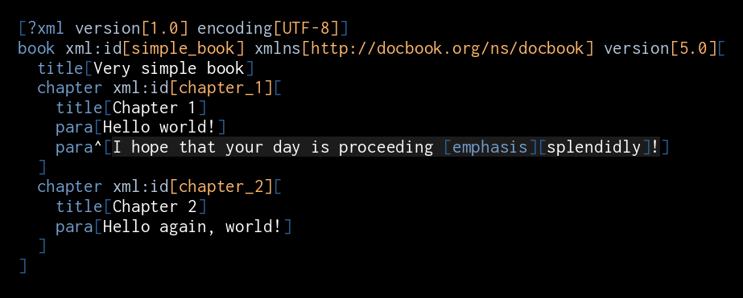

# Draft: Bare-butt XML

In this article I break down how the XML syntax can be reduced to a minimal essence. In a few steps we will end up with a much simpler syntax which is still human-readable and at the same time much more efficient for machines to process. It is trivially mappable to XML and [DOM](https://en.wikipedia.org/wiki/Document_Object_Model), so existing knowledge and tools can be leveraged when working with it. To do that would be to take a step towards realizing a [mad vision of total intercommunication of all software systems](2022-01-13-vision.md).

<!-- // Translating from XML to our format we accept loss of inessential information, such as the positions of `=` in attribute syntax or the exact location of XML entities.  -->

## Closing tags

The first most obvious candidate to eliminate in order to make XML more minimal are the closing tags. They increase the volume of XML significantly while complicating editing and processing. It is surely possible to get used to reading them and an argument can be made for them as an useful redundancy device. But our goal here is getting to the essence, and they are certainly not it.

Let's look at an example [(source)](https://en.wikipedia.org/wiki/DocBook#Sample_document):

```xml
<?xml version="1.0" encoding="UTF-8"?>
<book xml:id="simple_book" xmlns="http://docbook.org/ns/docbook" version="5.0">
  <title>Very simple book</title>
  <chapter xml:id="chapter_1">
    <title>Chapter 1</title>
    <para>Hello world!</para>
    <para>I hope that your day is proceeding <emphasis>splendidly</emphasis>!</para>
  </chapter>
  <chapter xml:id="chapter_2">
    <title>Chapter 2</title>
    <para>Hello again, world!</para>
  </chapter>
</book>
```

To get rid of the closing tags we can rewrite it like this:

```
<?xml version="1.0" encoding="UTF-8"?>
<book xml:id="simple_book" xmlns="http://docbook.org/ns/docbook" version="5.0"><
  <title><Very simple book>
  <chapter xml:id="chapter_1"><
    <title><Chapter 1>
    <para><Hello world!>
    <para><I hope that your day is proceeding <emphasis><splendidly>!>
  >
  <chapter xml:id="chapter_2"><
    <title><Chapter 2>
    <para><Hello again, world!>
  >
>
```

This is no longer valid XML, but it looks quite similar and it has identical logical structure. The original XML can be recreated from it exactly.

With this transformation we went from 458 to 395 characters, losslessly reducing the size of the data by almost 14%.

<!-- 395/458 = 0.8624454148471615 -->

## Quote marks and equals signs

The XML syntax has 5 special characters which may require escaping[[1]](https://www.w3.org/TR/REC-xml/#syntax)[[2]](https://www.w3.org/TR/REC-xml/#dt-escape): `<`, `>`, `&`, `'`, `"`.

We can reduce that by 40%, by getting rid of the apostrophe and the quote mark. How do we do that? We simplify the attribute syntax, like so:

1. We replace all `=` followed by opening `"` by `<`.
2. We replace all closing `"` by `>`.

Once we do that, our data looks like this:

```
<?xml version<1.0> encoding<UTF-8>?>
<book xml:id<simple_book> xmlns<http://docbook.org/ns/docbook> version<5.0>><
  <title><Very simple book>
  <chapter xml:id<chapter_1>><
    <title><Chapter 1>
    <para><Hello world!>
    <para><I hope that your day is proceeding <emphasis><splendidly>!>
  >
  <chapter xml:id<chapter_2>><
    <title><Chapter 2>
    <para><Hello again, world!>
  >
>
```

We didn't have very many attributes here, so the gain is not substantial for our sample (we are now at just over size 15% reduction). However for XML with a lot of attributes and/or escapes the gain will grow significantly. Particularly, every `&apos;` and `&quot;` will turn into `'` and `"` -- that's 5 characters saved for each occurence. Plus readability and convenience are significantly improved.

## Entities

Continuing the previous point in the spirit of being minimal, we will dispense with almost all  [entities](https://en.wikipedia.org/wiki/SGML_entity) altogether. Our format shall only support three fixed pseudoentities:

```
&&
&<
&>
```

which resolve to:


```
&
<
>
```

respectively.

With this move, we leave representing all special characters up to underlying encoding. The user is also always free to overlay their own entity mechanism on top of our simple format, if they wish. This makes for a better separation of concerns.

In today's world, where UTF-8 is widely supported, entities are not a common sight anyway.

Removing entities not only makes our format leaner and simpler, but also more secure[[1]](https://en.wikipedia.org/wiki/XML_external_entity_attack)[[2]](https://en.wikipedia.org/wiki/Billion_laughs_attack).

Our example uses no entities, so we save nothing on this. In general though replacing each unnecessary entity with a single character provides a very substantial reduction. Looking at [this list](https://en.wikipedia.org/wiki/List_of_XML_and_HTML_character_entity_references) an average ratio of 5:1 would be an underestimate.

Under compatible encodings we still preserve the ability to translate between XML and our format without loss of relevant information. Translating XML entities is a one-way operation, but that's fine for our purposes. Under incompatible encodings we'd of course still be able translate all offending characters to XML entities.

<!-- 388/395 = 0.9822784810126582 -- less than 2 %
388/458 = 0.8471615720524017 -- likewise less than 2 % -->

## Going further: what if we eliminated mixed content?

If we cut out ` <emphasis>splendidly</emphasis>` from our sample, we get:

```xml
<?xml version="1.0" encoding="UTF-8"?>
<book xml:id="simple_book" xmlns="http://docbook.org/ns/docbook" version="5.0">
  <title>Very simple book</title>
  <chapter xml:id="chapter_1">
    <title>Chapter 1</title>
    <para>Hello world!</para>
    <para>I hope that your day is proceeding!</para>
  </chapter>
  <chapter xml:id="chapter_2">
    <title>Chapter 2</title>
    <para>Hello again, world!</para>
  </chapter>
</book>
```

This way we got rid of all mixed content in our XML. In fact most XML used for data interchange (as opposed to text markup) avoids it, because, by the XML spec[[1]](https://www.w3.org/TR/xml/#sec-mixed-content) it is impossible to place the same constraints at mixed content elements as on regular elements.

If we constrain ourselves to a subset of XML which forbids mixed content, we can reduce the size of our data further, by getting rid of the brackets around opening tags:

```
?xml version<1.0> encoding<UTF-8>
book xml:id<simple_book> xmlns<http://docbook.org/ns/docbook> version<5.0><
  title<Very simple book>
  chapter xml:id<chapter_1><
    title<Chapter 1>
    para<Hello world!>
    para<I hope that your day is proceeding!>
  >
  chapter xml:id<chapter_2><
    title<Chapter 2>
    para<Hello again, world!>
  >
>
```

This gives us a nearly 20% reduction compared to the sample above.

<!-- 344/426
0.8075117370892019 -- almost 20 % -->


## Going back: special treatment of mixed content

In this case there is a way to have our cake and eat it too. We can reintroduce the mixed-content elements via a special syntax:

```
?xml version<1.0> encoding<UTF-8>
book xml:id<simple_book> xmlns<http://docbook.org/ns/docbook> version<5.0><
  title<Very simple book>
  chapter xml:id<chapter_1><
    title<Chapter 1>
    para<Hello world!>
    para^<I hope that your day is proceeding <emphasis><splendidly>!>
  >
  chapter xml:id<chapter_2><
    title<Chapter 2>
    para<Hello again, world!>
  >
>
```

Here the `^` in `para^` is a toggle which enables mixed content mode for the `para` element. The syntax inbetween the brackets of such an element is the same as before we eliminated brackets around the opening tags.

Plus we could easily implement selective switch back to no-mixed-content for all tags with names followed by the `^` toggle. Win-win?

Compared to the original sample we are again very close to a 20% reduction in size.

## Going ergonomic

To avoid confusion with XML proper and cut the number of keypresses needed to enter all special characters in half, as a final touch, we will perform a simple character substitution:

1. Replace all `<` with `[`
2. Replace all `>` with `]`
3. Replace all `&` with `` ` ``

This turns our sample into:

```
?xml version[1.0] encoding[UTF-8]
book xml:id[simple_book] xmlns[http://docbook.org/ns/docbook] version[5.0][
  title[Very simple book]
  chapter xml:id[chapter_1][
    title[Chapter 1]
    para[Hello world!]
    para^[I hope that your day is proceeding [emphasis][splendidly]!]
  ]
  chapter xml:id[chapter_2][
    title[Chapter 2]
    para[Hello again, world!]
  ]
]
```

Which is compatible with the cannonical [Jevko syntax](https://jevko.org).

## Going pretty

Now, let's add some colors:



and compare again:

```xml
<?xml version="1.0" encoding="UTF-8"?>
<book xml:id="simple_book" xmlns="http://docbook.org/ns/docbook" version="5.0">
  <title>Very simple book</title>
  <chapter xml:id="chapter_1">
    <title>Chapter 1</title>
    <para>Hello world!</para>
    <para>I hope that your day is proceeding <emphasis>splendidly</emphasis>!</para>
  </chapter>
  <chapter xml:id="chapter_2">
    <title>Chapter 2</title>
    <para>Hello again, world!</para>
  </chapter>
</book>
```

Not too bad if you ask me.

<!-- ## Conclusion -->

<!-- 369/458
0.8056768558951966
 -- almost 20 % -->

## See also

[Jevko as ultra-compact XML](2022-01-13-xml.md)