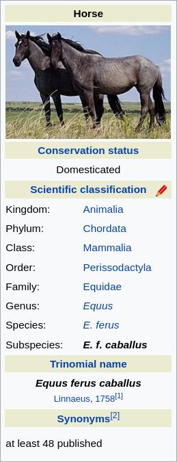

# Horse and carriage

This data from Wikipedia:



Could be represented in Jevko as follows:

```
Name [Horse]

Conservation status [Domesticated]
Scientific classification [
  Kingdom [Animalia]
  Phylum [Chordata]
  Class [Mammalia]
  Order [Perissodactyla]
  Family [Equidae]
  Genus [Equus]
  Species [E. ferus]
  Subspecies [E. f. caballus]
]
Trinomial name [
  [Equus ferus caballus]
  [Linnaeus, 1758]
] 
Synonyms [at least 48 published]
```

If we parse that using [the high-level grammar](2022-01-20-jevko-grammar.md), we will get a parse tree like:

```json
{
  "subjevkos": [
    {
      "prefix": "Name ",
      "jevko": {
        "subjevkos": [],
        "suffix": "Horse"
      }
    },
    {
      "prefix": "\n\nConservation status ",
      "jevko": {
        "subjevkos": [],
        "suffix": "Domesticated"
      }
    },
    {
      "prefix": "\nScientific classification ",
      "jevko": {
        "subjevkos": [
          {
            "prefix": "\n  Kingdom ",
            "jevko": {
              "subjevkos": [],
              "suffix": "Animalia"
            }
          },
          {
            "prefix": "\n  Phylum ",
            "jevko": {
              "subjevkos": [],
              "suffix": "Chordata"
            }
          },
          {
            "prefix": "\n  Class ",
            "jevko": {
              "subjevkos": [],
              "suffix": "Mammalia"
            }
          },
          {
            "prefix": "\n  Order ",
            "jevko": {
              "subjevkos": [],
              "suffix": "Perissodactyla"
            }
          },
          {
            "prefix": "\n  Family ",
            "jevko": {
              "subjevkos": [],
              "suffix": "Equidae"
            }
          },
          {
            "prefix": "\n  Genus ",
            "jevko": {
              "subjevkos": [],
              "suffix": "Equus"
            }
          },
          {
            "prefix": "\n  Species ",
            "jevko": {
              "subjevkos": [],
              "suffix": "E. ferus"
            }
          },
          {
            "prefix": "\n  Subspecies ",
            "jevko": {
              "subjevkos": [],
              "suffix": "E. f. caballus"
            }
          }
        ],
        "suffix": "\n"
      }
    },
    {
      "prefix": "\nTrinomial name ",
      "jevko": {
        "subjevkos": [
          {
            "prefix": "\n  ",
            "jevko": {
              "subjevkos": [],
              "suffix": "Equus ferus caballus"
            }
          },
          {
            "prefix": "\n  ",
            "jevko": {
              "subjevkos": [],
              "suffix": "Linnaeus, 1758"
            }
          }
        ],
        "suffix": "\n"
      }
    },
    {
      "prefix": " \nSynonyms ",
      "jevko": {
        "subjevkos": [],
        "suffix": "at least 48 published"
      }
    }
  ],
  "suffix": ""
}
```

The top-level object of this parse tree is a `jevko`. It contains a list of `subjevkos` and a `suffix`.

## Jevko as a sequence of characters, a string

```
Name [Horse]
```


```js
const jevkoToValue = (jevko) => {
  return jevko.suffix
}
```

## Jevko as a list of values

```js
const jevkoToValue = (jevko) => {
  return jevko.subjevkos.map(({jevko}) => jevkoToValue(jevko))
}
```

## Jevko as a collection of key-value pairs

Each `subjevko` contains a `prefix` associated with a nested `jevko`. Syntactically, the `prefix` is all the text which comes before the opening bracket `[`, and `jevko` is everything after the bracket up to the matching closing bracket `]`. 

Each `subjevko` looks and feels very similar to a key-value pair: the `prefix` can be interpreted as the key of the pair, and the nested `jevko` can be interpreted as the value of the pair.

A list of `subjevkos` of a `jevko` can then be seen as a collection of key-value pairs. It is very straightforward to turn such a collection into a proper associative array or a map, such as a JavaScript [Map](https://developer.mozilla.org/en-US/docs/Web/JavaScript/Reference/Global_Objects/Map), a plain JavaScript object, or an equivalent in any programming language.

```js
const jevkoToValue = (jevko) => {
  return Object.fromEntries(
    jevko.subjevkos.map(
      ({prefix, jevko}) => [prefix.trim(), jevkoToValue(jevko)]
    )
  )
}
```

## Putting it all together

<!-- In fact it can be done naively in just a few lines: -->

```js
const jevkoToValue = (jevko) => {
  const {subjevkos} = jevko
  if (subjevkos.length === 0) return jevko.suffix
  const {prefix} = subjevkos[0]
  if (prefix.trim() === '') return subjevkos.map(({jevko}) => jevkoToValue(jevko))
  return Object.fromEntries(
    subjevkos.map(({prefix, jevko}) => [prefix.trim(), jevkoToValue(jevko)])
  )
}
```


