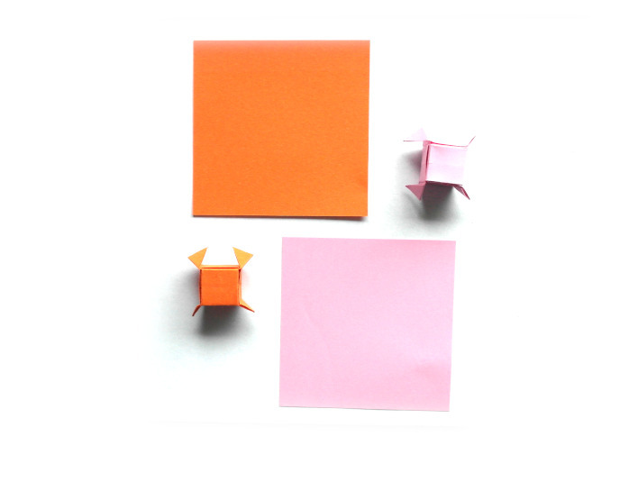
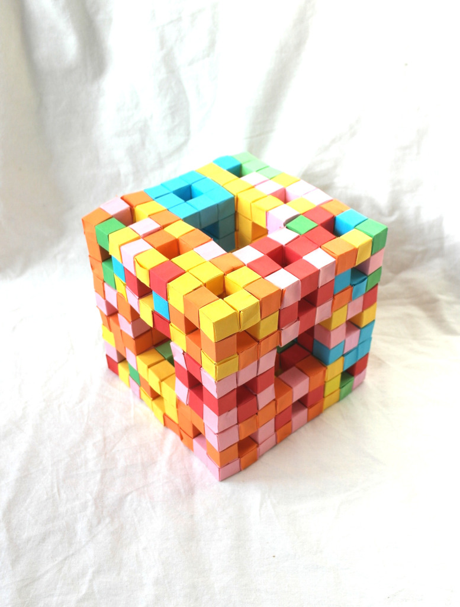
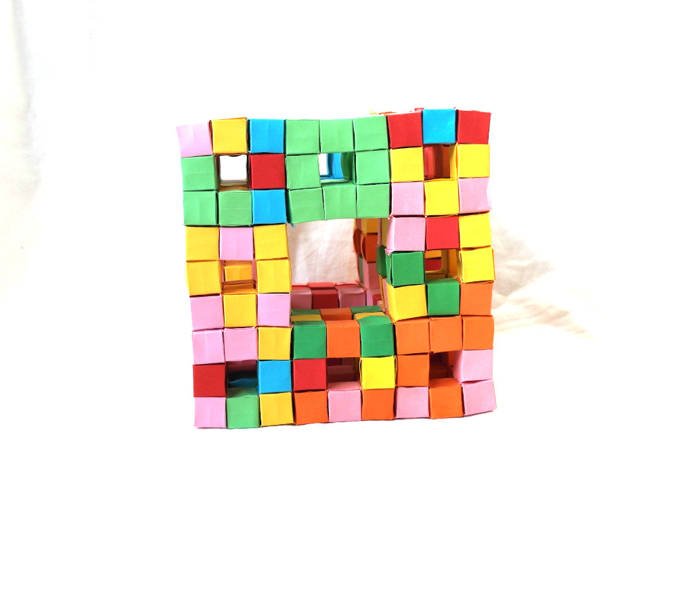

# Simple modular elements connected together into increasingly complex forms

It starts simple and quick:

Square pieces of plain paper, make them into little cubes.

Squares, cubes: pretty basic geometry.

However, the cubes are cleverly arranged in such a way that they can be connected together. Just by folding the parts that stick out from one into little matching pockets in another.

8 of these little cubes could be connected together into a little square ring donut. Take two of these donuts and connect them together with four more cubes (20 little cubes in total) -- you get a little [Sierpinski cube](https://en.wikipedia.org/wiki/Sierpinski_cube) module. Take 20 of these modules, connect them together and you get the second iteration of the Sierpinski cube.

400 little cubes in total:

A few minutes per cube plus a few minutes for folding, that adds up to a substantial amount of time. How many of these could one fold in a day? Realistically, on average?

400 cubes is around a man-month. Another iteration would then take close to 2 years. How long could one really keep that up continuously? What does it take? What's the point?

Does everything have to have a point? Is there an ultimate point? Have we figured it out yet? Do we agree on it? Is the truth self-evident to everyone who learns it?

